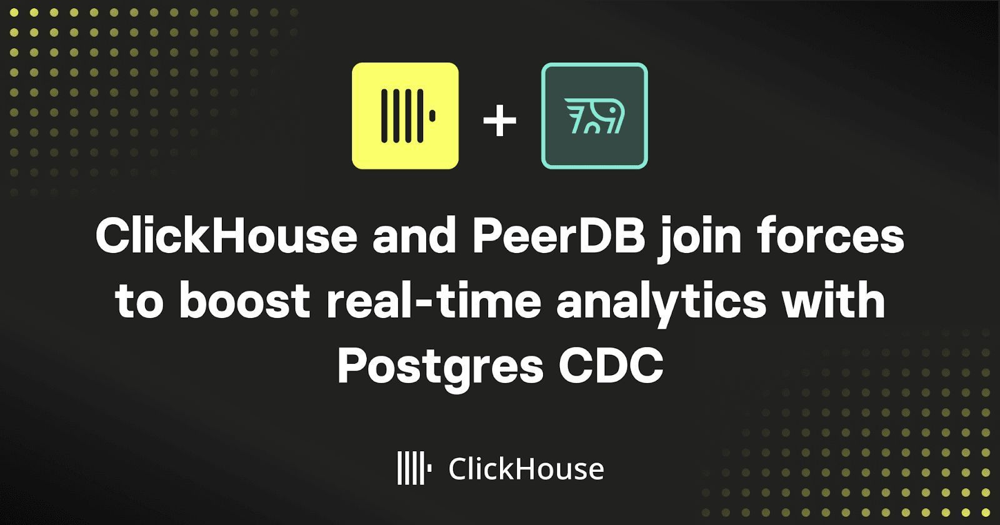

<div align="center">



#### Frustratingly simple ETL for Postgres

[](https://github.com/Peerdb-io/peerdb/actions/workflows/ci.yml)
[](https://github.com/PeerDB-io/peerdb/blob/main/LICENSE.md)
[](https://join.slack.com/t/peerdb-public/shared_invite/zt-1wo9jydev-EXInbMtCtpAKFFWdi7QvLQ)

</div>

## PeerDB

PeerDB is a Postgres-first data-movement platform that makes moving data in and out of Postgres fast and simple. It enables you to **sync**, **transform** and **query** data across your stores using simple SQL commands. We implement multiple Postgres native and infrastructural optimizations for 10x faster data-movement in and out of PostgreSQL.

You can use PeerDB for any of the below use-cases:

1. Real-time Change Data Capture from PostgreSQL.
2. Real-time Streaming of Query results across data-stores
3. Federated query workloads - Query multiple data-stores through a common SQL interface

## Get started

```bash
git clone --recursive git@github.com:PeerDB-io/peerdb.git
cd peerdb

# Run docker containers: peerdb-server, postgres as catalog, temporal
export COMPOSE_PROJECT_NAME=peerdb-stack
docker compose up

# connect to peerdb and query away
psql "port=9900 host=localhost password=peerdb"
```


Follow this 5-minute [Quickstart Guide](https://docs.peerdb.io/quickstart#quickstart) to see PeerDB in action i.e. streaming data in real-time across stores.

## Why PeerDB

Current data tools prioritize a wide range of connectors, often neglecting to optimize for Postgres users. This can be problematic for those storing large amounts of data in Postgres and frequently transferring it. As a result, many resort to building custom pipelines when existing tools don't meet their needs. We've developed this project to provide a straightforward and reliable solution specifically for Postgres.

### Postgres-first Approach

PeerDB is an ETL/ELT tool built for PostgreSQL. We implement multiple Postgres native and infrastructural optimizations to provide a fast, reliable and a feature-rich experience for moving data in/out of PostgreSQL.

**For performance** -  we can parallelize initial load for a large table, still ensuring consistency. Syncing 100s of GB reduces from days to minutes. Our architecture is designed for real-time syncs and implements multiple logical replication related optimizations (tuning Postgres configs, parallel reading of slot etc.). This enables 10x faster Change Data Capture with data-freshness of a few 10s of seconds even at large throughputs (10k+ tps).

**For reliability**, we have mechanisms in place for fault tolerance - state management, automatic retries, handling idempotency and consistency and so on (<https://blog.peerdb.io/using-temporal-to-scale-data-synchronization-at-peerdb>) Configurable batching and parallelism prevent out of memory (OOMs) and crashes.

**From a feature richness standpoint**, we support efficient syncing of tables with large (TOAST) columns. We support multiple streaming modes - Log based (CDC) based, Query based streaming etc. We provide rich data-type mapping and plan to support every possible (incl. Custom types) that Postgres supports to the best extent possible on the target data-store.

#### **Postgres-compatible SQL interface to do ETL**

The Postgres-compatible SQL interface for ETL is unique to PeerDB and enables you to operate in a language you are familiar with. You can do ETL the same way you work with your databases.

You can use Postgres’ eco-system to manage your ETL —

1. Client tools like pgAdmin, psql to run SQL commands.
2. BI tools like Grafana, Tableau to visually monitor syncs and transforms.
3. Database migration and versioning tools like Flyway to manage your ETL.
4. Any language (Python, Go, Node.js etc) and Scheduler (AirFlow) for development.
5. And many more

## Status

We support multiple target connectors to move data from Postgres and a couple of source connectors to move data into Postgres. Check the status of connectors [here](https://docs.peerdb.io/sql/commands/supported-connectors)

#### Metrics for MIRROR

Both types of MIRRORs export some crucial metrics with regards to the health of the MIRROR. By default, our development Docker stack does not capture or visualize these metrics. They are available in a Docker Compose profile called `metrics`, which can be enabled by:

```bash
# add --profile metrics like this in front of any docker compose command being used.
docker compose --profile metrics up --build
```

This sets up both a Prometheus instance on port 9090 that scrapes the metrics from the flow workers, and also a Grafana instance on port 3000 that reads and visualizes the metrics from mirrors in a preconfigured dashboard. To view the dashboard, access the Grafana instance on `localhost:3000` with the user `admin` and the password `peerdb`.

## License

PeerDB is licensed under Elastic License 2.0 (ELv2). Please see the LICENSE file for additional information. If you have any licensing questions please email **<founders@peerdb.io>**
