# PeerDB Extended Design Document — Deep Dive

**Status**: Living Document
**Audience**: Engineers wanting code-level understanding of specific subsystems
**Companion to**: [PeerDB Architecture](./peerdb-architecture.md)
**Last Updated**: 2026-03-16

> This document goes beyond the architecture document to provide implementation-level detail, design tradeoffs, known limitations (TODOs), and code pointers for each major subsystem.

---

## Table of Contents

1. [PostgreSQL CDC — Logical Replication Deep Dive](#1-postgresql-cdc--logical-replication-deep-dive)
2. [MySQL CDC — Binlog Replication Deep Dive](#2-mysql-cdc--binlog-replication-deep-dive)
3. [MongoDB CDC — Change Streams Deep Dive](#3-mongodb-cdc--change-streams-deep-dive)
4. [Normalization & Merge Engine](#4-normalization--merge-engine)
5. [Snapshot System](#5-snapshot-system)
6. [CDC Workflow Orchestration](#6-cdc-workflow-orchestration)
7. [Activity Layer — Pull/Sync/Normalize Pipeline](#7-activity-layer--pullsyncnormalize-pipeline)
8. [Type System & Conversion Pipeline](#8-type-system--conversion-pipeline)
9. [Known Limitations & Technical Debt](#9-known-limitations--technical-debt)
10. [Error Handling & Resilience Patterns](#10-error-handling--resilience-patterns)

---

## 1. PostgreSQL CDC — Logical Replication Deep Dive

**Key files**: `flow/connectors/postgres/cdc.go`, `flow/connectors/postgres/postgres.go`

### 1.1 Architecture

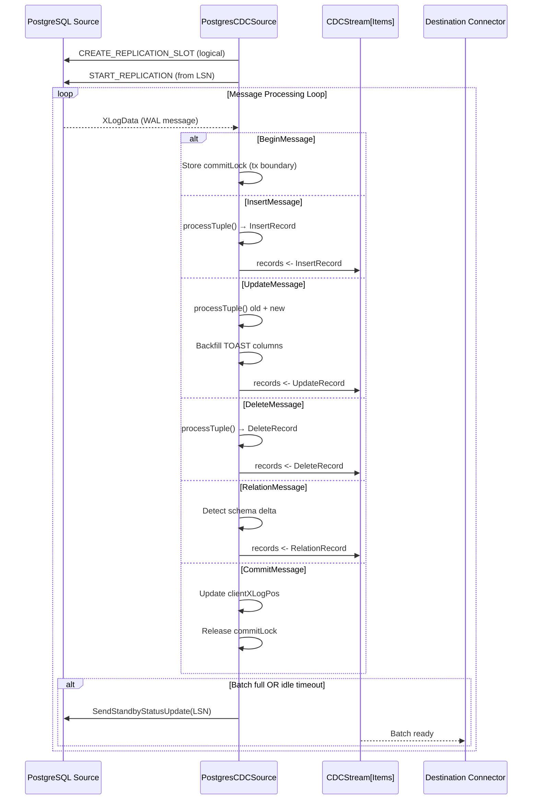

### 1.2 The PostgresCDCSource Structure

```go
type PostgresCDCSource struct {
    *PostgresConnector
    srcTableIDNameMapping     map[uint32]string          // OID → table name
    tableNameMapping          map[string]model.NameAndExclude
    tableNameSchemaMapping    map[string]*protos.TableSchema
    relationMessageMapping    model.RelationMessageMapping
    childToParentRelIDMapping map[uint32]uint32           // partitioned table support
    slot                      string
    publication               string
    commitLock                *pglogrepl.BeginMessage     // current open transaction
    catalogPool               shared.CatalogPool
    otelManager               *otel_metrics.OtelManager
}
```

### 1.3 Message Processing Loop

The core loop in `PullCdcRecords` uses `pglogrepl` to receive WAL messages:

1. **Timeout Management**: Initial 1-hour timeout before first record, then switches to configured `IdleTimeout`. This prevents premature exits on slow sources while being responsive during active replication.

2. **Standby Status Updates**: Sent to PostgreSQL to acknowledge consumed LSN. Critical — without these, the replication slot accumulates WAL and can fill the disk.

3. **Batch Control**: Returns when `totalRecords >= maxBatchSize` OR idle timeout reached. If a transaction is open (`commitLock != nil`), waits for the `CommitMessage` before returning to ensure atomic batch boundaries.

**Metrics reporting** happens every 1 minute, logging record count, bytes, and channel length.

### 1.4 TOAST Column Handling

PostgreSQL uses TOAST (The Oversized-Attribute Storage Technique) for large column values. During replication, unchanged TOAST columns are sent with data type `'u'` (unchanged) instead of their actual value.

```go
// In processTuple():
if tcol.DataType == 'u' {
    unchangedToastColumns[rcol.Name] = struct{}{}
}
```

**For UpdateRecords**, the old tuple's values are backfilled into the new tuple for columns that exist in both:

```go
backfilledCols := newItems.UpdateIfNotExists(oldItems)
for _, col := range backfilledCols {
    delete(unchangedToastColumns, col)
}
```

**For DeleteRecords**, a sentinel value is added to prevent normalization from selecting missing columns.

**Design tradeoff**: On pre-PG15, TOAST columns are NOT properly updated during normalize fallback (UPSERT+DELETE). The workaround is to use `REPLICA IDENTITY FULL` or upgrade to PG15+ for MERGE support.

**Important caveat**: TOAST column handling is a best-effort solution. Values are backfilled by looking them up from an in-memory cache (that spills to disk) generated _per batch_. If an insert and its corresponding update are not in the same batch, the update's TOAST value will not be successfully backfilled.

### 1.5 Schema Evolution via RelationMessages

When a DDL change occurs (e.g., `ALTER TABLE ADD COLUMN`), PostgreSQL sends a `RelationMessage` with the new schema.

**Detection logic** (`processRelationMessage`):
1. Compare current `RelationMessage.Columns` with cached `prevSchema` from catalog
2. Build maps: `prevRelMap` (existing) vs `currRelMap` (new)
3. Identify added columns by diffing
4. Fetch type info via `GetSchemaNameOfColumnTypeByOID()`
5. Emit `RelationRecord` with `TableSchemaDelta` to the stream

**Known issue**:
> TODO: replident is cached here, should not cache since it can change

Replica identity can change at runtime (e.g., `ALTER TABLE ... REPLICA IDENTITY FULL`), but the current code caches it on first read.

### 1.6 Partitioned Table Support

For PostgreSQL partitioned tables, child partitions have separate relation IDs from the parent:

```go
childToParentRelIDMapping map[uint32]uint32  // child relid → parent relid
```

`checkIfUnknownTableInherits()` translates child→parent when an unknown relation ID appears, ensuring partitioned table events are correctly attributed.

### 1.7 LSN Checkpoint Management

**Storage**: Catalog (default) or destination peer (Postgres→Postgres optimization)

**Update triggers**:
- During idle periods when `totalRecords == 0` and `clientXLogPos > lastConsumedOffset`
- On every `CommitMessage` (in-memory `latestCheckpointID`)
- Persisted to the catalog (or destination peer for Postgres→Postgres) at batch boundaries

### 1.8 Known Edge Cases

- **PG 15-15.1 bug** (`cdc.go`): Replication column lists can send tuples with wrong column count. PeerDB validates tuple length against expected columns. See: [PostgreSQL mailing list thread](https://www.postgresql.org/message-id/CADGJaX9kiRZ-OH0EpWF5Fkyh1ZZYofoNRCrhapBfdk02tj5EKg@mail.gmail.com)

- **TIMETZ workaround** (`cdc.go`): "ugly TIMETZ workaround for CDC decoding" — special handling needed for time with timezone type in logical decoding.

- **Invalid year values** (`cdc.go`): Time types with years outside Go's `time.Time` range can be inserted into Postgres but not represented in Go. These are nulled with warning logs.

- **JSON null vs SQL null** (`cdc.go`): "avoid confusing SQL null & JSON null by using pre-marshaled value" — explicit distinction to prevent data corruption.

---

## 2. MySQL CDC — Binlog Replication Deep Dive

**Key files**: `flow/connectors/mysql/cdc.go`, `flow/connectors/mysql/mysql.go`

### 2.1 Architecture

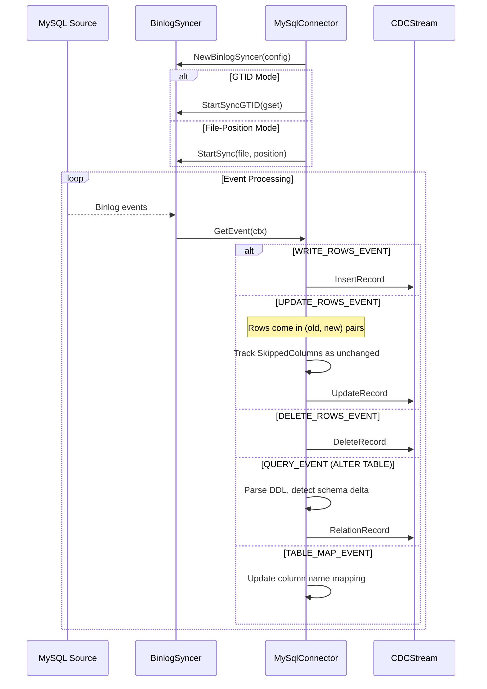

### 2.2 GTID vs File-Position Mode

**Auto-detection** in `SetupReplication()`:

```go
if config.ReplicationMechanism == protos.MySqlReplicationMechanism_MYSQL_AUTO {
    gtidModeOn, err = c.GetGtidModeOn(ctx)
}
```

| Aspect | GTID Mode | File-Position Mode |
|--------|-----------|-------------------|
| **Offset format** | GTID set string (e.g., `"uuid:1-100"`) | `!f:binlog_file,hex_position` |
| **Resume** | `StartSyncGTID(gset)` | `StartSync(file, pos)` |
| **Advantages** | Server-agnostic, survives binlog rotation | Simple, universally supported |
| **Limitations** | Requires GTID enabled on server | Tied to specific binlog file sequence |
| **MariaDB** | Uses MariaDB GTID flavor | Supported |

### 2.3 Row Event Processing

**UPDATE events** come in pairs — old row then new row:

```go
for idx := 0; idx < len(ev.Rows); idx += 2 {
    oldRow := ev.Rows[idx]
    newRow := ev.Rows[idx+1]
    // Track skipped (unchanged) columns via ev.SkippedColumns
}
```

**Unchanged column tracking** mirrors PostgreSQL's TOAST handling — `SkippedColumns` from the binlog are mapped to `UnchangedToastColumns` on the record.

### 2.4 Schema Evolution

Detected via `QueryEvent` containing `ALTER TABLE` statements. Column mapping relies on `TABLE_MAP_EVENT.ColumnName`.

**Known fragility** (`cdc.go`):
> TODO this is fragile

`sourceTableName` is constructed by concatenating `Schema.Table`, which can fail with edge-case naming.

**Position-shifting DDLs**: When a column is added with `FIRST` or `AFTER`, column positions shift. Requires `binlog_row_metadata=FULL` for reliable mapping. Without it, column ordering may be incorrect.

### 2.5 Metadata Storage Design

MySQL connector does NOT store state in the source database. Instead, it uses `PostgresMetadata` (the PeerDB catalog):

```go
type MySqlConnector struct {
    *metadataStore.PostgresMetadata  // Embeds catalog-backed metadata
    config  *protos.MySqlConfig
    conn    atomic.Pointer[client.Conn]
    // ...
}
```

**Design decision**: Source databases should never be modified by PeerDB. All CDC state (binlog position, batch IDs, partition checkpoints) lives in the PeerDB catalog.

---

## 3. MongoDB CDC — Change Streams Deep Dive

**Key files**: `flow/connectors/mongo/cdc.go`, `flow/connectors/mongo/codec.go`

### 3.1 Architecture

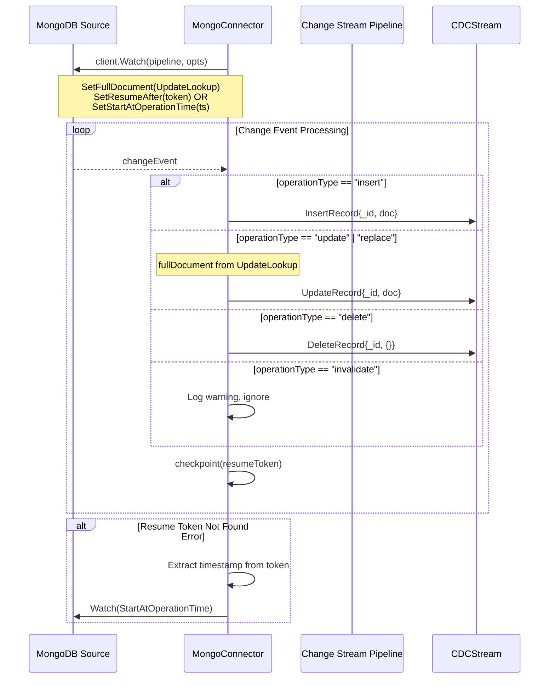

### 3.2 Pipeline Configuration

The change stream pipeline is built to filter and reduce event size:

1. **Match stage** (when specific tables selected):
   ```bson
   {$match: {$or: [{$and: [{ns.db: "db"}, {ns.coll: {$in: [...]}}]}]}}
   ```

2. **Project stage** (performance optimization — `cdc.go`):
   > Mongo recommends using '$project' first to reduce change event size, and only use '$changeStreamSplitLargeEvent' in the pipeline if still necessary. Given the documents themselves have a 16MB limit, project required fields for now for code simplicity.

### 3.3 Adaptive Timeout Strategy

```go
// Before first record: wait up to 1 hour 
initialWait := time.Hour

// After first record: switch to configured idleTimeout
afterFirstRecord := config.IdleTimeout
```

**Rationale**: Change streams on low-traffic collections may not produce events for extended periods. The 1-hour initial wait prevents premature timeouts while the shorter idle timeout ensures responsive batching during active replication.

### 3.4 Resume Token Recovery

**Normal resume**: `SetResumeAfter(base64DecodedToken)`

**Fallback when resume token expired or refers to filtered-out table** (`cdc.go`):
> This can happen if the resumeToken we are attempting to ResumeAfter refers to a table that has been filtered out of the change stream pipeline (for example, if a user pauses and edits a mirror). If this happens, we decode the resumeToken and extract its operation time, and start a new changeStream with StartAtOperationTime instead of ResumeAfter.

### 3.5 fullDocument Absence Scenarios

When using `UpdateLookup`, the `fullDocument` field may be missing (`cdc.go`):

1. Insert operations (document IS the fullDocument)
2. Document deleted or collection dropped between the update event and the lookup
3. Update changes the shard key, causing the document to move between shards

### 3.6 QRep Partition Boundary Duplication

**Known limitation** (`mongo/qrep.go`):
> with $bucketAuto, buckets except the last bucket treat their max value as exclusive. we can't tell what bucket is the 'last' bucket without additional tracking, so we accept boundary records being inserted twice

This means QRep with MongoDB may produce duplicate records at partition boundaries. Destinations with upsert/merge handle this correctly, but append-only destinations may see duplicates.

---

## 4. Normalization & Merge Engine

**Key file**: `flow/connectors/postgres/normalize_stmt_generator.go`

### 4.1 MERGE Statement (PG15+)

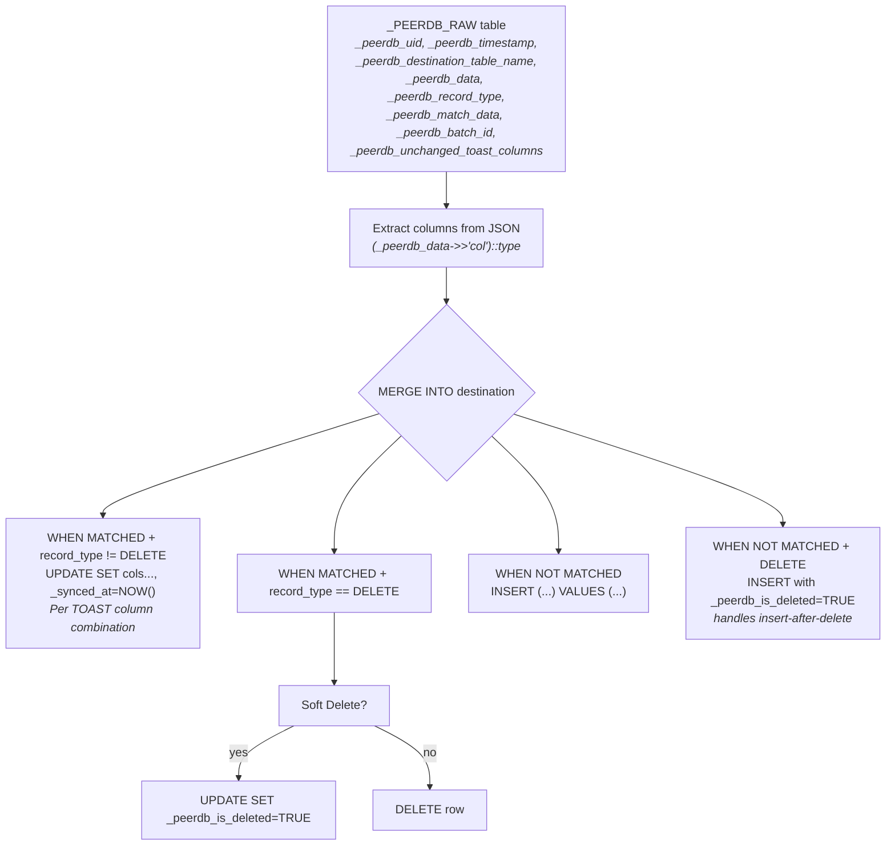

### 4.2 TOAST-Aware MERGE Branches

The MERGE statement generates **one branch per unique combination of unchanged TOAST columns**. This is necessary because different update events may have different TOAST columns unchanged:

```sql
-- Branch for updates where col_large1 is unchanged:
WHEN MATCHED AND src._peerdb_record_type!=2
     AND _peerdb_unchanged_toast_columns='col_large1'
THEN UPDATE SET col_small=src.col_small, _synced_at=CURRENT_TIMESTAMP
-- (col_large1 NOT in SET clause — preserves existing value)

-- Branch for updates where col_large1 AND col_large2 are unchanged:
WHEN MATCHED AND src._peerdb_record_type!=2
     AND _peerdb_unchanged_toast_columns='col_large1,col_large2'
THEN UPDATE SET col_small=src.col_small, _synced_at=CURRENT_TIMESTAMP
```

### 4.3 Pre-PG15 Fallback (UPSERT + DELETE)

```sql
-- Statement 1: UPSERT (handles INSERT and UPDATE)
INSERT INTO dst_table (cols...)
SELECT cast_cols... FROM _PEERDB_RAW_...
ON CONFLICT (pk_cols) DO UPDATE SET col1=EXCLUDED.col1, ...

-- Statement 2: DELETE
DELETE FROM dst_table USING _PEERDB_RAW_...
WHERE dst.pk = raw.pk AND record_type = 2
```

**Warnings logged** (`normalize_stmt_generator.go`):
- "Postgres version is not high enough to support MERGE, falling back to UPSERT+DELETE"
- "TOAST columns will not be updated properly, use REPLICA IDENTITY FULL or upgrade Postgres"
- "soft delete enabled with fallback statements! this combination is unsupported"

### 4.4 Special Type Handling in SQL Generation

| Type | SQL Expression |
|------|---------------|
| Arrays | `ARRAY(SELECT JSON_ARRAY_ELEMENTS_TEXT((_peerdb_data->>'col')::JSON))::<type>` |
| Bytes | `decode(_peerdb_data->>'col', 'base64')::<type>` |
| Standard | `(_peerdb_data->>'col')::<type>` |

### 4.5 Soft Delete Edge Cases

**Insert after soft-delete** (`normalize_stmt_generator.go`): A special MERGE clause handles the case where a deleted row is re-inserted — it sets `_peerdb_is_deleted=FALSE`.

**Delete-update ordering** (`normalize_stmt_generator.go`):
> generates update statements for the case where updates and deletes happen in the same branch. the backfill has happened from the pull side already, so treat the DeleteRecord as an update

### 4.6 Destination-Specific Strategies

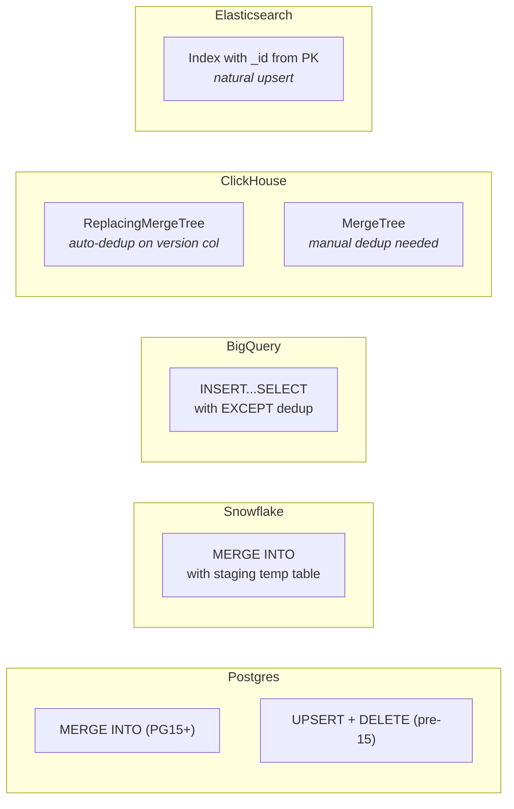

---

## 5. Snapshot System

**Key files**: `flow/workflows/snapshot_flow.go`, `flow/activities/snapshot_activity.go`

### 5.1 Snapshot Modes

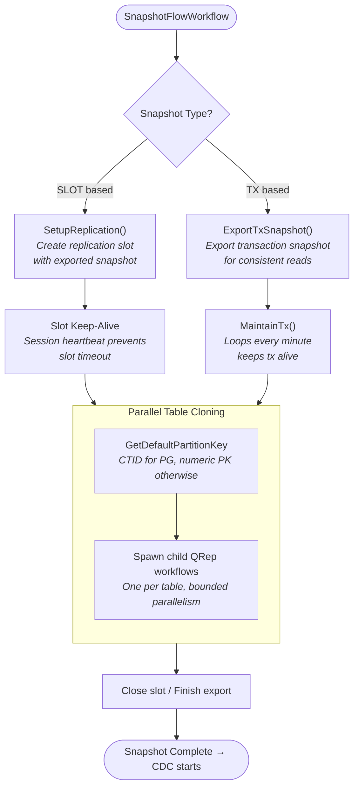

### 5.2 Configuration

| Parameter | Default | Description |
|-----------|---------|-------------|
| `SnapshotMaxParallelWorkers` | 8 | Threads per table |
| `SnapshotNumRowsPerPartition` | 250,000 | Rows per QRep partition |
| `SnapshotNumPartitionsOverride` | 0 | Explicit partition count (0 = auto) |

### 5.3 CTID Partitioning

PostgreSQL CTID (physical row ID) is used for efficient parallel reads:
- Format: `(block_id, offset_in_block)`
- Not a primary key — can change after VACUUM
- Guaranteed unique within a snapshot
- Better distribution than sequential PKs (avoids hotspots)

**Partition calculation**: The partition count is calculated based on estimated row count, then an NTILE query groups rows into buckets. The projected min and max CTIDs from this query are used as partition ranges for each bucket. A separate `MinMaxRangePartitioning` strategy exists but is only triggered when users select custom partitioning keys. There are plans to migrate to `CTIDBlockPartitioning` as the default strategy since NTILE can be slow/expensive on large tables.

**Note** (`postgres/qrep.go`):
> NOTE: it appears that the hypercore 'TAM' may give us access to ctid scans, but that's to be removed in Timescale 2.22

### 5.4 Slot Keep-Alive

```go
type SlotSnapshotState struct {
    connector      connectors.CDCPullConnectorCore
    connectorClose func(ctx context.Context)
    slotConn       interface{ Close(context.Context) error }
    snapshotName   string
}
```

No explicit heartbeat needed — the replication slot is managed by Postgres. The workflow session maintains the connection for the entire snapshot duration. If the workflow dies, the replication slot remains on Postgres until explicitly dropped or timed out.

### 5.5 Elasticsearch Special Case

For Elasticsearch destinations:
> ensure document IDs are synchronized across initial load and CDC for the same document

Uses UPSERT write mode with primary keys to ensure document IDs match between snapshot and CDC.

---

## 6. CDC Workflow Orchestration

**Key file**: `flow/workflows/cdc_flow.go`

### 6.1 Complete State Machine

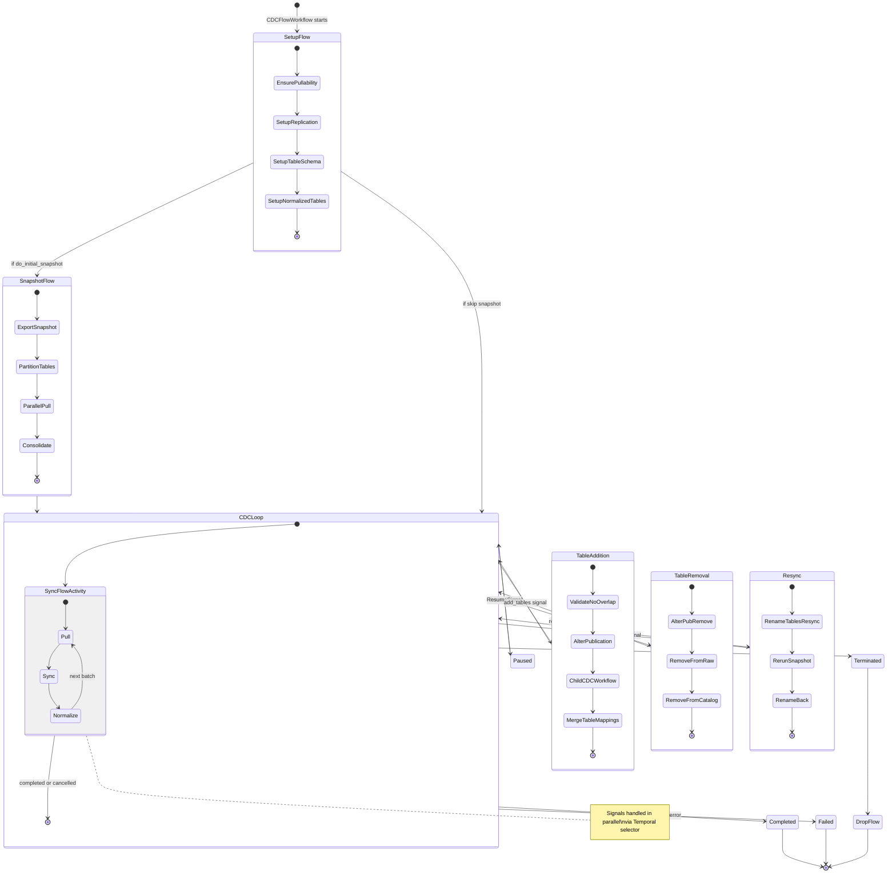

### 6.2 Signal Handling

Three signal channels:

| Signal | Purpose | Effect |
|--------|---------|--------|
| `FlowSignalStateChange` | Pause/Resume/Terminate/Resync | Changes `ActiveSignal` on state |
| `CDCDynamicPropertiesSignal` | Batch size, idle timeout, table mappings | Updates `FlowConfigUpdate` |
| `FlowSignal` (legacy) | State transitions | Routes to handler |

**Pause loop**: Blocks at `selector.Select(ctx)` waiting for signal. Processes `FlowConfigUpdate` while paused (config updates are applied on resume via `ContinueAsNewError`).

### 6.3 Table Addition Mid-Flow

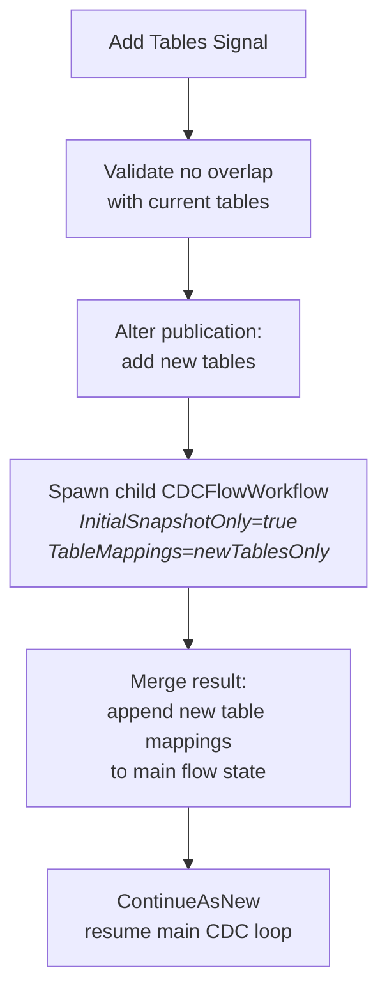

### 6.4 Resync Flow

Resync recreates destination tables while preserving the mirror:

1. Alter table names (append `_resync` suffix, except ClickHouse)
2. Re-run SetupFlow + SnapshotFlow with resync tables
3. Rename tables back (swap `_resync` → original name)
4. Resume main CDC loop

### 6.5 Config Sync to Catalog

Before each sync iteration (`cdc_flow.go`), the CDC flow config is updated with latest dynamic settings and synced to the catalog for consistency. This ensures that if the workflow restarts, it picks up the latest configuration.

---

## 7. Activity Layer — Pull/Sync/Normalize Pipeline

**Key files**: `flow/activities/flowable.go`, `flow/activities/flowable_core.go`

### 7.1 Pipeline Architecture

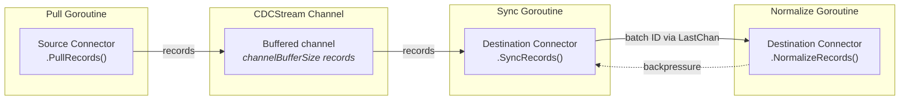

### 7.2 The `syncCore` Generic Function

The core of the activity pipeline is generic over connector and item types:

```go
func syncCore[
    TPull connectors.CDCPullConnectorCore,
    TSync connectors.CDCSyncConnectorCore,
    Items model.Items,
](ctx, activity, config, options, srcConn, ...) (*model.SyncResponse, error)
```

**Checkpoint loading optimization**: For Postgres→Postgres, the last offset is read from the destination (avoids catalog lookup delay):

```go
if _, isSourcePg := any(srcConn).(*connpostgres.PostgresConnector) {
    dstPgConn.GetLastOffset(ctx, flowName)  // Direct from destination
} else {
    metadata.GetLastOffset(ctx, flowName)   // From catalog
}
```

### 7.3 Backpressure via LastChan

The `LastChan` pattern prevents the normalizer from falling too far behind sync:

```go
if normResponses.Load() <= normWaitThreshold {
    // Block sync until normalize catches up
    for normResponses.Load() <= normWaitThreshold {
        select {
        case <-normResponses.Wait():
        case <-ctx.Done():
        }
    }
}
```

### 7.4 Normalize Loop

Runs as a separate goroutine with its own retry logic:

```go
for {
    reqBatchID := normalizeRequests.Load()
    if reqBatchID <= normalizingBatchID.Load() {
        continue  // Already normalized
    }

    retryInterval := time.Minute
    for {
        err := startNormalize(ctx, config, reqBatchID)
        if err == nil {
            break
        }
        time.Sleep(retryInterval)
        retryInterval = min(retryInterval*2, 5*time.Minute)
    }
}
```

### 7.5 Schema Delta Application

Uses a read-modify-write pattern (`flowable_core.go`):

1. Read current schema from catalog
2. Deep copy to avoid mutation
3. Deduplicate column additions (prevent applying same delta twice)
4. Write back with transactional guarantee

**TODO** (`internal/postgres.go`):
> TODO: use ReadModifyWriteTableSchemasToCatalog to guarantee transactionality

---

## 8. Type System & Conversion Pipeline

### 8.1 Dual Type System

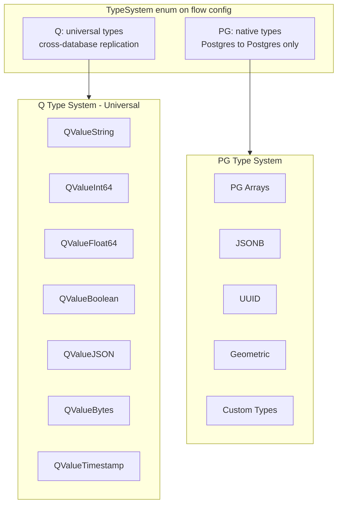

### 8.2 PgItems Optimization

When both source and destination are PostgreSQL, `PgItems` passes native `pgx` types directly, avoiding the double conversion:

```
PG Source → pgx types (PgItems) → PG Destination
```

vs the generic path:

```
PG Source → QValue (intermediate) → type mapping → Destination types
```

### 8.3 Workarounds in Type Conversion

- **Undefined pgtype workaround** (`postgres/qvalue_convert.go`, `type_conversion.go`): "workaround for some types not being defined by pgtype" — custom registration for types not in the pgx type system.

- **BigQuery JSON columns** (`bigquery/qrep_object_pull.go`): "Parquet export does not support JSON columns, so we need to cast them. BigQuery SDK does not support query_statement overrides for export jobs."

- **BigQuery DATETIME→TIMESTAMP** (`bigquery/qrep_object_pull.go`): "Cast DATETIME to TIMESTAMP for Parquet export since BigQuery DATETIME is timezone-unaware and its Parquet representation may not be compatible with ClickHouse."

---

## 9. Known Limitations & Technical Debt

### 9.1 Known Design Limitations

1. **Pre-PG15 normalization**: TOAST columns not properly preserved with UPSERT+DELETE fallback. Mitigation: use REPLICA IDENTITY FULL.
   > **Note**: Even on PG15+, TOAST column backfill is best-effort. Values are backfilled from an in-memory cache (spilling to disk) generated per batch. If an insert and its corresponding update land in different batches, the update's TOAST value will not be successfully backfilled.

2. **At-least-once delivery**: The pipeline guarantees at-least-once delivery, not exactly-once, so duplicates can occur in various scenarios (not limited to MongoDB). ClickHouse's ReplacingMergeTree (RMT) automatically deduplicates on merge, but if a user chooses MergeTree (MT), destination data may contain duplicates. MongoDB's `$bucketAuto` additionally causes boundary records to be inserted twice.

3. **MySQL schema evolution without binlog_row_metadata=FULL**: Column position-shifting DDLs (ADD COLUMN FIRST/AFTER) are rejected, but may still cause incorrect column mapping without full row metadata.

4. **Soft delete + pre-PG15**: Explicitly unsupported combination, logged as warning.

5. **SSH tunnel DNS resolution** (`ssh_wrapped_conn.go`): "DNS lookup seems to happen before connection is established which can be an issue if given host can only be resolved on the SSH host."

6. **SSH handshake protection** (`ssh_wrapped_conn.go`): Body length limited during initial handshake to prevent crash from misbehaved TCP endpoints that send random bytes.

### 9.2 Idempotency Requirements

Several connector methods are documented as requiring idempotency (`core.go`):
> should be idempotent, and should be able to be called multiple times with the same request

This is critical because Temporal may replay activities after failures. All state-mutating operations must handle duplicate execution gracefully.

---

## 10. Error Handling & Resilience Patterns

### 10.1 Error Classification

Errors are classified into types primarily for alerting purposes:

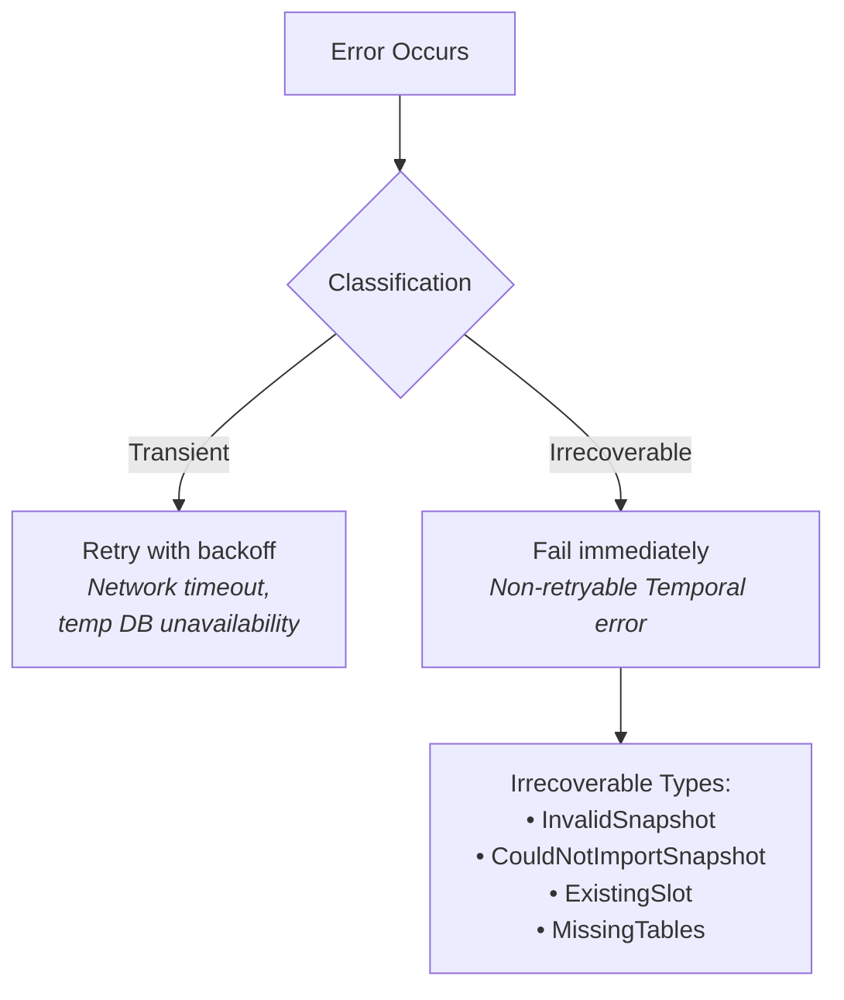

### 10.2 Custom Error Types

**Replication Errors** (`shared/exceptions/primary_key_and_replica_identity.go`):

| Error | Meaning |
|-------|---------|
| `PrimaryKeyModifiedError` | Cannot locate PK column value during CDC |
| `ReplicaIdentityIndexError` | Table has no replica identity index |
| `ReplicaIdentityNothingError` | Table has REPLICA IDENTITY NOTHING |
| `MissingPrimaryKeyError` | Table lacks PK and not REPLICA IDENTITY FULL |

**Application Error Types** (`shared/exceptions/application.go`):

| Type | Temporal Behavior |
|------|------------------|
| `ApplicationErrorTypeIrrecoverableInvalidSnapshot` | Non-retryable |
| `ApplicationErrorTypeIrrecoverableCouldNotImportSnapshot` | Non-retryable |
| `ApplicationErrorTypeIrrecoverableExistingSlot` | Non-retryable |
| `ApplicationErrorTypIrrecoverableMissingTables` | Non-retryable |

### 10.3 Transactional DDL

PostgreSQL supports transactional DDL, which PeerDB leverages for normalization setup (`postgres.go`):
> Postgres is cool and supports transactional DDL. So we use a transaction.

This means table creation + schema setup is atomic — if any step fails, nothing is committed.

### 10.4 Connection Resilience

- **CheckConnection activity** (`flowable.go`): Verifies peer connection is active with graceful error handling
- **SSH keep-alive**: Periodic heartbeat to prevent tunnel timeout
- **RDS IAM token refresh**: Automatic token renewal before expiry
- **Replication connection**: Separate from query connection, with mutex (`replLock`) for thread safety

---

## Appendix A: Key File Reference

| File | Purpose |
|------|---------|
| `flow/connectors/core.go` | All connector interfaces + type assertions |
| `flow/connectors/postgres/cdc.go` | PostgreSQL WAL replication |
| `flow/connectors/postgres/normalize_stmt_generator.go` | MERGE/UPSERT SQL generation |
| `flow/connectors/postgres/postgres.go` | Core Postgres connector |
| `flow/connectors/mysql/cdc.go` | MySQL binlog replication |
| `flow/connectors/mongo/cdc.go` | MongoDB change streams |
| `flow/workflows/cdc_flow.go` | CDC workflow orchestration |
| `flow/workflows/qrep_flow.go` | QRep workflow |
| `flow/workflows/snapshot_flow.go` | Snapshot orchestration |
| `flow/activities/flowable.go` | Main activity handler |
| `flow/activities/flowable_core.go` | Core pull/sync/normalize logic |
| `flow/model/` | Record types, streams, QValue |
| `protos/flow.proto` | CDC/QRep protobuf definitions |
| `protos/peers.proto` | Peer config definitions |
| `protos/route.proto` | gRPC service definition |

## Appendix B: Performance Tuning Reference

| Parameter | Default | Where Set | Effect |
|-----------|---------|-----------|--------|
| `max_batch_size` | 250,000 | Flow config | Records per CDC batch |
| `idle_timeout_seconds` | 60 | Flow config | Wait before empty batch |
| `snapshot_num_rows_per_partition` | 250,000 | Flow config | Rows per snapshot partition |
| `snapshot_max_parallel_workers` | 8 | Flow config | Parallel snapshot threads |
