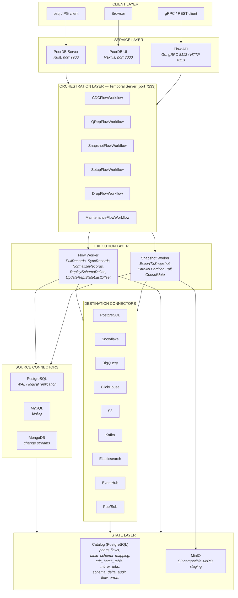
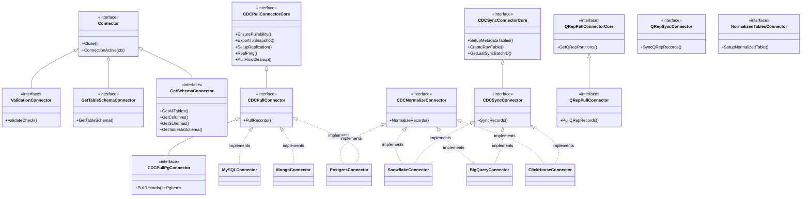
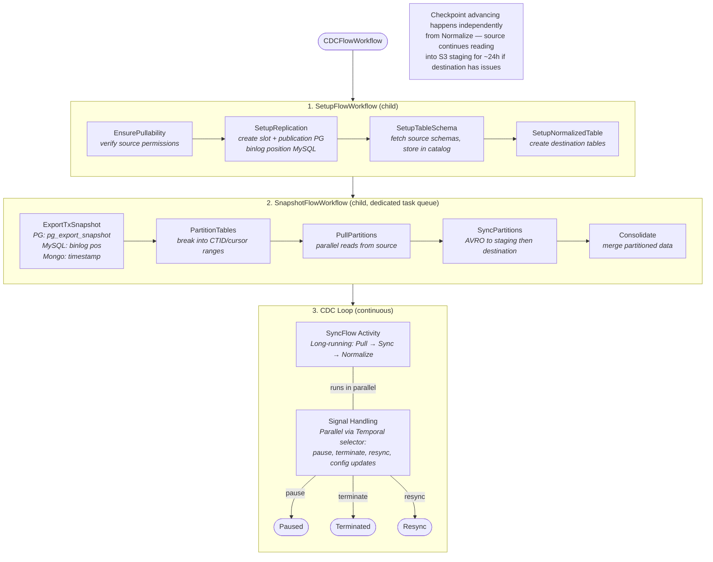
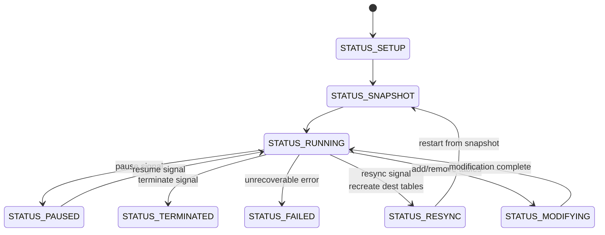
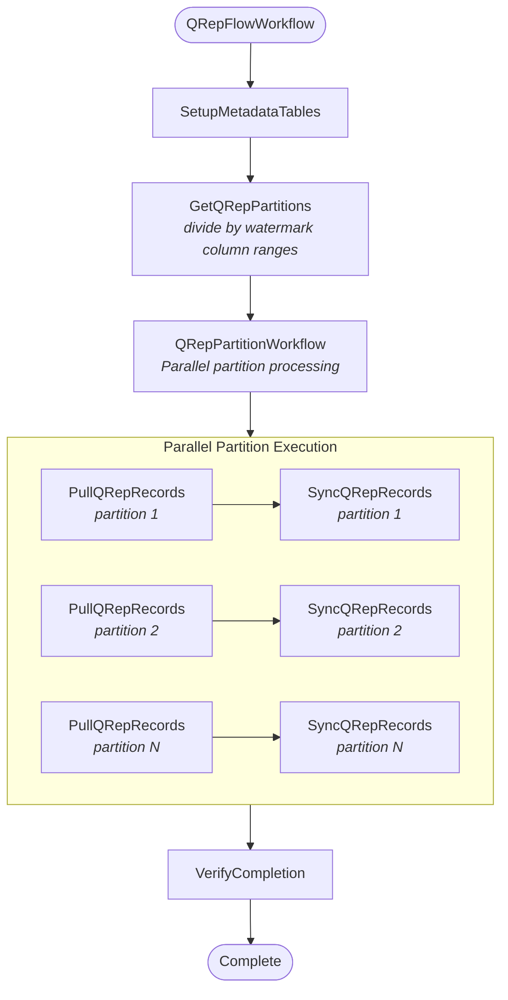
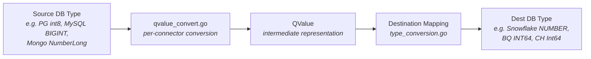

# PeerDB Architecture Design Document

**Status**: Living Document
**Authors**: Platform Architecture Team
**Date**: 2026-03-16
**Audience**: All engineers, new hires, cross-functional stakeholders

---

## 1. Executive Summary

PeerDB is a distributed ETL/ELT system purpose-built for streaming data from transactional databases (PostgreSQL, MySQL, MongoDB) to analytical destinations (Snowflake, BigQuery, ClickHouse, S3, Kafka, Elasticsearch, and more). It provides Change Data Capture (CDC), Query Replication (QRep), and initial snapshot capabilities, orchestrated through Temporal workflows and exposed via a PostgreSQL-compatible SQL interface.

---

## 2. System Architecture Overview



---

## 3. Service Components

### 3.1 PeerDB Server (Nexus) — Rust

**Location**: `/nexus/`
**Entry point**: `nexus/server/src/main.rs`
**Port**: 9900

A PostgreSQL-compatible wire protocol server that allows users to manage PeerDB using familiar SQL commands:

```sql
CREATE PEER my_source FROM POSTGRES WITH (...);
CREATE MIRROR my_mirror FROM my_source TO my_dest WITH (...);
ALTER MIRROR my_mirror ADD TABLES ...;
SELECT * FROM mirror_status;
DROP MIRROR my_mirror;
```

**Key subsystems**:
- **PgWire Server**: Implements PostgreSQL wire protocol (SCRAM-SHA-256 auth)
- **SQL Parser**: Custom parser for PeerDB DDL extensions (`CREATE PEER`, `CREATE MIRROR`)
- **Query Executor**: Routes queries to appropriate peer executors or the Flow API
- **Catalog Integration**: Encrypted credential storage with optional KMS

**Rust workspace crates**: `analyzer`, `catalog`, `flow-rs`, `parser`, `peer-ast`, `peer-bigquery`, `peer-mysql`, `peer-postgres`, `peer-snowflake`, `postgres-connection`, `pt` (protobuf types), `server`, `value`

### 3.2 Flow API — Go

**Location**: `/flow/cmd/handler.go`
**Ports**: 8112 (gRPC), 8113 (HTTP gateway via grpc-gateway)

The gRPC API layer that manages the lifecycle of mirrors and peers. Key service methods:

| Category | Methods |
|----------|---------|
| **Flow Management** | `CreateCDCFlow`, `CreateQRepFlow`, `FlowStateChange`, `DropFlow`, `CancelTableAddition` |
| **Monitoring** | `MirrorStatus`, `GetCDCBatches`, `CDCTableTotalCounts`, `TotalRowsSyncedByMirror`, `CDCGraph`, `ListMirrorLogs` |
| **Peer Management** | `CreatePeer`, `ValidatePeer`, `DropPeer`, `ListPeers`, `GetSchemas`, `GetTablesInSchema`, `GetColumns` |
| **Admin** | `Maintenance`, `GetMaintenanceStatus`, `PostDynamicSetting` |

The API handler (`FlowRequestHandler`) wraps a Temporal client, catalog pool, and alerter. It never directly manages connector lifecycles — all data movement is delegated through Temporal workflows.

### 3.3 Flow Worker & Snapshot Worker — Go

**Location**: `/flow/cmd/worker.go`
**Task queues**: `peerflow` (default), `snapshot-flow` (dedicated)

Workers register 40+ Temporal activities and execute the actual data movement:

- **Flow Worker**: Handles CDC sync loops, normalization, QRep partitions, schema operations
- **Snapshot Worker**: Dedicated to initial snapshot operations (separate task queue prevents snapshot work from starving CDC)

Configuration: Max concurrent activities = 1000, max concurrent workflow tasks = 1000.

### 3.4 PeerDB UI — Next.js

**Location**: `/ui/`
**Port**: 3000 (3030 in dev)

Dashboard for creating/monitoring peers and mirrors. Communicates with the Flow API via the HTTP gateway. Built with React 19, Radix UI components, Chart.js for visualization, and Monaco editor for SQL editing.

### 3.5 Temporal Server

**Port**: 7233

Temporal provides durable workflow execution with automatic retries, checkpointing, and fault tolerance. PeerDB uses it for:
- Orchestrating multi-step CDC/QRep/snapshot flows
- Signal-based flow control (pause, resume, terminate, resync)
- Search attributes for mirror name filtering
- Activity retry with exponential backoff

### 3.6 Catalog (PostgreSQL)

**Port**: 5432 (9901 in dev)

Stores all PeerDB metadata: peer configurations (encrypted), flow definitions (serialized protobuf), CDC batch progress, schema mappings, and error logs. Uses `pgxpool` with max_conns=3 and 90s idle timeout.

### 3.7 MinIO

S3-compatible object storage used for staging AVRO files during snapshot operations. In production, replaced by actual S3/GCS.

---

## 4. Supported Connectors — Complete Matrix

### 4.1 Source Connectors

| Connector | CDC Mechanism | QRep | Initial Snapshot | Key Features |
|-----------|--------------|------|-----------------|--------------|
| **PostgreSQL** | WAL logical replication (pglogrepl) | Cursor-based with tx snapshots | Parallel CTID partitions | TOAST handling, schema evolution, custom types, RDS/IAM auth, SSH tunnels, Postgres→Postgres native CDC |
| **MySQL** | Binary log replication (go-mysql) | Cursor-based | Parallel partitions | GTID and file-position modes, MariaDB support, binlog retention monitoring |
| **MongoDB** | Change Streams API | Aggregation pipelines | Collection scan | Resume tokens, `fullDocument: updateLookup`, read preferences, Atlas support |
| **BigQuery** | — | Object-based pull | — | GCP service account auth, Parquet export |

### 4.2 Destination Connectors

| Connector | CDC Sync | Normalize/Merge | QRep Sync | Key Features |
|-----------|----------|----------------|-----------|--------------|
| **PostgreSQL** | Raw table insert | MERGE (PG15+) or UPSERT fallback | Direct insert | Soft delete, schema evolution, synced_at column |
| **Snowflake** | Raw table + AVRO staging | SQL MERGE | AVRO file load | Merge-based upsert, AVRO consolidation, warehouse staging |
| **BigQuery** | AVRO bulk load | INSERT with dedup | GCS object load | Clustering, partitioning, GCP service account auth |
| **ClickHouse** | Raw table insert | ReplacingMergeTree / MergeTree | AVRO via S3/table functions | Partition keys, sharding keys, engine selection, S3 IAM, AVRO staging |
| **S3** | — | — | AVRO file write | Deflate/snappy/zstd codecs |
| **Kafka** | Topic publish | — | Partition-based | SASL auth, custom partitioner |
| **Elasticsearch** | Index documents | — | Bulk index | Index creation, mapping management, upsert key support |
| **Azure EventHub** | Event publish | — | — | Partition hashing, Azure-native |
| **Google Pub/Sub** | Topic publish | — | — | GCP-native |

### 4.3 Connector Interface Hierarchy

All connectors implement a composition of capability interfaces defined in `/flow/connectors/core.go`:



Compile-time type assertions at the end of `core.go` verify that each connector correctly implements its declared interfaces.

---

## 5. Data Flow: CDC (Change Data Capture)

### 5.1 Workflow: `CDCFlowWorkflow`

**Location**: `/flow/workflows/cdc_flow.go`



### 5.2 Flow States



### 5.3 Record Types

```go
type CDCStream[T Items] struct {
    emptySignal        chan struct{}
    records            chan Record[T]
    lastCheckpointText string                       // MySQL GTID / MongoDB ResumeToken
    SchemaDeltas       []*protos.TableSchemaDelta
    lastCheckpointID   int64
    lastCheckpointSet  bool
    needsNormalize     bool
    empty              bool
    emptySet           bool
}

// T is either RecordItems (generic) or PgItems (Postgres-native pgx types)
// Records are multiplexed across destination tables (one source stream to many destinations)
type InsertRecord[T Items] struct {
    Items                T
    SourceTableName      string
    DestinationTableName string
    CommitID             int64
    BaseRecord
}
type UpdateRecord[T Items] struct {
    OldItems              T
    NewItems              T
    UnchangedToastColumns map[string]struct{}
    SourceTableName       string
    DestinationTableName  string
    BaseRecord
}
type DeleteRecord[T Items] struct {
    Items                 T
    UnchangedToastColumns map[string]struct{}
    SourceTableName       string
    DestinationTableName  string
    BaseRecord
}
type RelationRecord[T Items] struct {
    TableSchemaDelta *protos.TableSchemaDelta
    BaseRecord
}
```

### 5.4 Raw Staging Table Schema

All CDC destinations receive records into a raw staging table with this structure:

| Column | Type | Description |
|--------|------|-------------|
| `_peerdb_uid` | UUID | Unique record identifier |
| `_peerdb_timestamp` | BIGINT | Source event time (UnixNano) |
| `_peerdb_destination_table_name` | TEXT | Target table for this record |
| `_peerdb_data` | JSONB | All column values as JSON |
| `_peerdb_record_type` | INTEGER | 0 (insert), 1 (update), 2 (delete) |
| `_peerdb_match_data` | JSONB | Old row data (for updates/deletes) |
| `_peerdb_batch_id` | INTEGER | Batch sequence number |
| `_peerdb_unchanged_toast_columns` | TEXT | Comma-separated list of unchanged TOAST columns |

---

## 6. Data Flow: Normalization

Normalization transforms raw staged records into the final destination table format.

### 6.1 Steps

1. **Extract JSON**: Unpack individual columns from `_peerdb_data`
2. **Apply soft deletes**: If configured, mark `D` records via `soft_delete_col_name = true` instead of deleting
3. **Add sync timestamp**: Populate `synced_at_col_name` with current time
4. **Handle upserts**: Use MERGE (PG15+, Snowflake), INSERT with dedup (BigQuery), or ReplacingMergeTree (ClickHouse)
5. **Apply schema deltas**: ALTER TABLE for new columns detected during CDC

### 6.2 Destination-Specific Strategies

| Destination | Merge Strategy |
|-------------|---------------|
| PostgreSQL | `MERGE INTO` (15+) or `INSERT...ON CONFLICT` + `DELETE` |
| Snowflake | `MERGE INTO` with staging temp table |
| BigQuery | `INSERT...SELECT` with `EXCEPT` dedup |
| ClickHouse | ReplacingMergeTree (auto-dedup) or MergeTree |
| Elasticsearch | Index with `_id` from primary key |

---

## 7. Data Flow: Query Replication (QRep)

### 7.1 Workflow: `QRepFlowWorkflow`

**Location**: `/flow/workflows/qrep_flow.go`

`QRepFlowWorkflow` is most commonly triggered as a child workflow from `SnapshotFlowWorkflow`, which creates **one `QRepFlowWorkflow` per table** being snapshotted. It can also be triggered as a standalone workflow when a user creates a query replication mirror (available in PeerDB OSS).



### 7.2 Partition Column Types

| Range Type | Use Case |
|------------|----------|
| IntPartitionRange | Integer watermark columns |
| TimestampPartitionRange | Timestamp watermark columns |
| TIDPartitionRange | PostgreSQL CTID (physical row ID) |
| UIntPartitionRange | Unsigned integers |
| ObjectIdPartitionRange | MongoDB ObjectIDs |
| NullPartitionRange | Rows with NULL watermark |

### 7.3 Partitioning Strategies

| Strategy | Description |
|----------|-------------|
| CTID Range | Default for PostgreSQL snapshots — uses NTILE to group rows into buckets by CTID |
| MinMaxRange | Computes min/max of a custom partitioning key and divides into ranges |
| CTIDBlock | Planned future default — block-based CTID ranges, avoids expensive NTILE query |

### 7.4 Write Modes

- **APPEND**: Insert all rows (default)
- **UPSERT**: Merge using `upsert_key_columns`
- **OVERWRITE**: Truncate then insert (`initial_copy_only`)

---

## 8. Data Flow: Initial Snapshot

### 8.1 PostgreSQL Snapshot

1. `pg_export_snapshot()` — freeze a consistent view of all tables
2. Partition each table into CTID ranges for parallel reads
3. Pull partitions in parallel using the exported snapshot
4. Stream AVRO files to staging (MinIO/S3/GCS)
5. Consolidate staged data on the destination

The replication slot created during setup holds WAL from the snapshot point, ensuring no data is lost between snapshot completion and CDC start.

### 8.2 MySQL / MongoDB Snapshot

Uses QRep-based initial load with cursor partitioning instead of transaction snapshot. Tracks binlog position (MySQL) or change stream timestamp (MongoDB) at snapshot start for seamless CDC handoff.

---

## 9. Type System

### 9.1 Dual Type Systems

PeerDB supports two type systems controlled by the `TypeSystem` enum on flow config:

- **Q**: Universal/generic type system — maps all source types to a common intermediate representation. Used for cross-database replication (many sources to many destinations).
- **PG**: PostgreSQL-native types — arrays, JSONB, UUID, geometric types, custom types. Used specifically when Postgres is both source and destination.

### 9.2 Type Conversion Pipeline



### 9.3 Special Type Handling

| Type | Handling |
|------|----------|
| TOAST columns | Tracked via `unchanged_toast_columns`; best-effort backfill from per-batch cache |
| JSON/JSONB | Parsed based on destination capability |
| Custom PG types | Resolved via `pg_catalog` type OID mapping |
| Unbounded numeric | `unbounded_numeric_as_string` flag for precision |
| Arrays | Connector-specific conversion per element type |
| Geospatial | Requires `libgeos`; WKT/WKB conversion |

---

## 10. Protocol Buffers & API

### 10.1 Proto Definitions

**Location**: `/protos/`

| File | Contents |
|------|----------|
| `flow.proto` | `FlowConnectionConfigsCore`, `TableMapping`, `TableSchema`, `QRepConfig`, `FlowStatus`, CDC/QRep messages |
| `peers.proto` | Peer type enum, per-database config messages (PostgresConfig, MySQLConfig, MongoConfig, etc.) |
| `route.proto` | `FlowService` gRPC service definition with all RPC methods |

### 10.2 Code Generation

Generated code is produced by `buf generate` and lives in:
- **Go**: `flow/generated/protos/` (protobuf + gRPC + gateway)
- **Rust**: `nexus/pt/src/gen/` (prost + tonic)
- **TypeScript**: `ui/grpc_generated/` (ts-proto, types only)

---

## 11. Key Configuration

### 11.1 FlowConnectionConfigsCore (CDC)

```protobuf
message FlowConnectionConfigsCore {
    string flow_job_name = 1;
    repeated TableMapping table_mappings = 4;
    uint32 max_batch_size = 5;               // records per batch
    uint64 idle_timeout_seconds = 6;          // wait before empty batch
    string cdc_staging_path = 7;              // S3/GCS staging
    string publication_name = 8;              // PG publication
    string replication_slot_name = 9;         // PG slot
    bool do_initial_snapshot = 10;
    uint32 snapshot_num_rows_per_partition = 11;
    uint32 snapshot_max_parallel_workers = 13;
    string soft_delete_col_name = 18;
    string synced_at_col_name = 19;
    string script = 20;                       // Lua transformation
    TypeSystem system = 21;                   // Q or PG
    string source_name = 22;
    string destination_name = 23;
}
```

### 11.2 TableMapping

```protobuf
message TableMapping {
    string source_table_identifier = 1;
    string destination_table_identifier = 2;
    string partition_key = 3;        // Parallel snapshotting
    repeated string exclude = 4;      // Column exclusions
    repeated ColumnSetting columns = 5;
    TableEngine engine = 6;           // ClickHouse engine
    string sharding_key = 7;
    string partition_by_expr = 9;
}
```

### 11.3 Dynamic Settings

Runtime-tunable via `PostDynamicSetting` API. These are system-wide settings that affect worker behavior, feature toggles, and operational parameters.

---

## 12. Observability

- **OpenTelemetry**: Metrics (records pulled/synced, bytes, latency) and traces exported from Temporal activities
- **Temporal UI**: Workflow execution history, pending activities, signal log
- **Flow API monitoring endpoints**: `MirrorStatus`, `CDCGraph`, `ListMirrorLogs`, `CDCTableTotalCounts`
- **Alerting**: Email and Slack notifications on flow errors
- **pprof**: Optional Go profiling (`ENABLE_PROFILING=true`)
- **Structured logging**: `slog` in Go, `RUST_LOG` in Rust

---

## 13. Security

- **Peer credentials**: Encrypted at rest in the catalog with optional KMS integration
- **Authentication**: SCRAM-SHA-256 for the PeerDB server; per-connector auth (IAM, SSH tunnels, TLS, SASL)
- **Network**: SSH tunnel support for all connectors; TLS with custom CA certificates
- **Cloud IAM**: RDS IAM auth for Postgres/MySQL; GCP service accounts for BigQuery/PubSub; Azure managed identity for EventHub

---

## 14. Lua Scripting

PeerDB supports Lua-based record transformation via the `script` field on flow config. This allows users to:
- Filter records
- Transform column values
- Add computed columns
- Route records to different tables

Libraries: `glua64`, `gluajson`, `gluamsgpack` for Lua runtime support.
